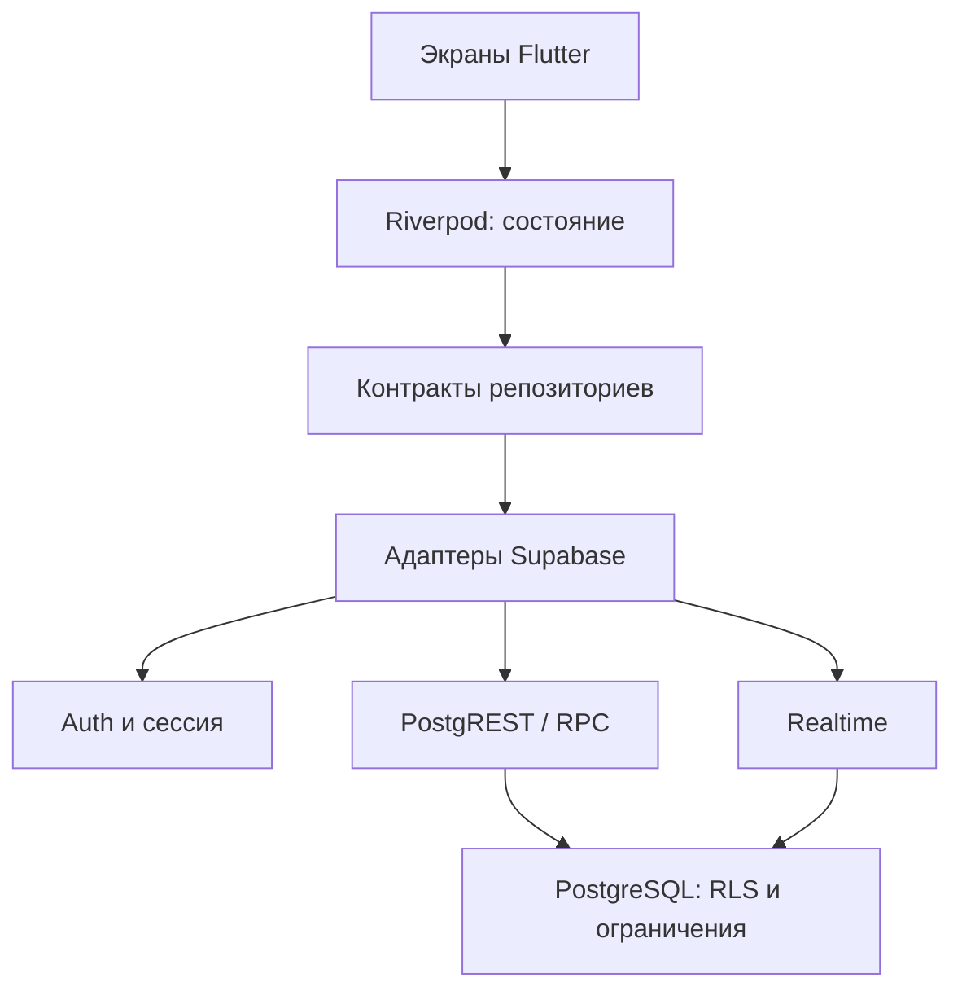

# Архитектура

## Структура

```text
moy_prihod/
  lib/
    main.dart
    app/
      app.dart
      router/                  маршруты и безопасные переходы
      shell/                   адаптивная навигационная оболочка
    core/
      access/                  снимок разрешений для UI
      backend/                 внедрение SupabaseClient
      config/                  публичная конфигурация и валидация
      errors/                  безопасные сообщения об ошибках
      id/                      UUID для повторяемых операций
      pagination/              курсор и страница результатов
    design_system/
      tokens.dart              палитра, отступы, радиусы, breakpoints
      app_theme.dart           ThemeData light/dark
      theme_controller.dart    system/light/dark и сохранение выбора
      components/              общие элементы состояний и контейнеров
    features/
      auth/
      feed/
      parishes/
      membership/
      map/
      chats/
      events/
      help/
      notifications/
      profile/
      administration/
  assets/brand/
  config/
  web/
  supabase/
    migrations/
    tests/
  scripts/
  test/
  docs/
```

В реализованных модулях есть `domain/`, `data/`, `application/`, `presentation/`. Пустые файлы репозиториев для ещё не реализованных функций не созданы: карта имеет контракт адаптера, профиль содержит четыре слоя, приватные данные и настройки оформления. Administration реализует все четыре слоя и формы управления.

## Ответственность слоёв

| Слой | Назначение | Допустимые зависимости |
|---|---|---|
| domain | Неизменяемые модели, интерфейсы репозиториев | Dart, при необходимости domain другого модуля |
| data | Supabase-запросы и преобразование данных | domain, Supabase SDK |
| application | Состояние, загрузка, координация | domain, Riverpod; wiring конкретных data-адаптеров |
| presentation | Виджеты, формы, локальное UI-состояние | application, domain, design_system |
| app | Сборка зависимостей, навигация, жизненный цикл | Точки входа модулей |

Начальное wiring сделано в provider-файлах фич. Репозитории заменяемы через overrides. Для длинных многошаговых сценариев добавлять use-case/application-controller; не превращать `core` в хранилище всей бизнес-логики. Обработчики простых форм сейчас могут координировать вызов репозитория и invalidate; транзакции и правила доступа принадлежат серверу.



## Навигация

`StatefulShellRoute.indexedStack` сохраняет независимые ветки: Лента, Mellon, Карта, Чаты, Ещё. Из «Ещё» открываются приходы, события, помощь, уведомления, настройки и разрешённый административный вход. Детали прихода и чат используют корневой Navigator, поверх оболочки. Android back и browser back обрабатывает go_router.

| Путь | Требование |
|---|---|
| `/feed`, `/parishes`, `/parishes/:id` | Публичное чтение по RLS |
| `/events`, `/help`, `/map` | Публичная часть; приватные строки фильтрует RLS |
| `/my-parish`, `/chats`, `/chats/:id` | Сессия; членство и доступ к чату проверяет сервер |
| `/notifications` | Сессия; только собственные уведомления |
| `/profile` | Оформление доступно гостю; аккаунт — после входа |
| `/admin`, `/admin/parishes/new` | Сессия; создание требует `parishes.manage` |
| `/admin/parishes/:id`, `/edit`, `/requests`, `/posts/new`, `/posts/:postId` внутри прихода | Конкретное разрешение на выбранный приход; сервер проверяет каждое действие |
| `/auth` | Вход/регистрация и безопасный возврат |

Проверка маршрута нужна для интерфейса. Она не считается защитой API. Переходы после входа и из уведомлений допускают только известные внутренние пути. Поддержка event/location deep link будет добавлена вместе с детальной карточкой события и картой.

## Состояние и приватность на устройстве

Источником истины остаётся сервер. Провайдеры данных зависят от сессии: при смене пользователя перестраиваются запросы и подписки. `AsyncContent` показывает загрузку заново при смене зависимостей. Realtime-провайдеры autoDispose освобождают подписки, когда перестают использоваться. При возврате приложения на передний план обновляются членство, разрешения и основные списки.

В SharedPreferences сохраняется режим темы; Supabase SDK отдельно управляет своей сессией. Приватные ленты/сообщения не записываются в постоянный офлайн-кэш. Web session storage доступен JavaScript текущего origin: не подключать непроверенные сторонние скрипты. Для Android перед production отдельно выбрать и протестировать защищённый storage-адаптер сессии; сейчас используется механизм SDK.

Отзыв прав действует в БД со следующего запроса, без перевыпуска JWT. Уже показанный текст нельзя отозвать с устройства; активный экран может сохранять его до обновления. Для production нужен канал события смены прав/членства с сбросом соответствующего состояния. Подписки на публичные материалы никогда не заменяют повторную проверку доступа.

## Адаптивность и дизайн

Цвета находятся в `AppPalette`/`ColorScheme`, темы — в `AppTheme`. Типографика, карточки, формы и кнопки настраиваются централизованно. Отступы и радиусы имеют единые токены. Максимальная ширина контента ограничивает длину строки, но не фиксирует экран; формам задана максимальная, а не обязательная ширина.

Компактные экраны используют нижнюю навигацию. Широкие и достаточно высокие — NavigationRail; короткий landscape остаётся с компактной навигацией. `Expanded`, `LayoutBuilder`, `Wrap`, `SafeArea`, прокрутка форм и стандартное уменьшение Scaffold под клавиатуру обеспечивают основу адаптации. Размер системного шрифта не отключается. Пользовательских жёстких высот экранов нет.

Light/dark строятся из общего seed, system следует устройству. Выбор сохраняется отдельно от пользовательских данных. На Safari нужны реальные проверки safe-area, клавиатуры, свайпов, экранного поворота и standalone; один CSS viewport не доказывает совместимость.

## Масштабирование

UUID-связи, индексы по приходу и времени, курсор `(published_at,id)` для ленты. Страницы ленты по 20 записей; чаты/уведомления ограничены последними 50. Каталог приходов и простые списки пока ограничены первой страницей: интерфейс «загрузить ещё» обязателен перед ростом данных. Поиск по имени сейчас `ILIKE`; при больших объёмах — pg_trgm/полнотекстовый индекс. Для геопоиска добавить PostGIS geography/GiST, сохранив контракт карты.

Не делать преждевременное шардирование. Сначала измерять запросы и нагрузку RLS, затем материализовать необходимые счётчики, внедрять Realtime Broadcast вместо массовых Postgres Changes, очередь push и отдельные медиа-процессы. Изменения схемы — только миграциями с обратной совместимостью между версиями клиентов.

## Модуль управления

`AdminRepository` отделяет формы от транспорта. Провайдеры чтения зависят от сессии; после записи обновляются списки управления, публичный каталог, лента, членство и разрешения. Формы хранят локально только несохранённые поля, состояние отправки и ошибку. Серверные данные не копируются в постоянный кэш.

Списки приходов, публикаций и заявок имеют курсор и размер страницы 20, с выборкой 21-й строки для кнопки «Далее». Приходы сортируются по UUID; публикации и заявки — по времени и UUID. Формы прокручиваются при клавиатуре и увеличенном тексте, используют общие темы и ограничения максимальной ширины.

UUID создаваемой записи остаётся неизменным при повторе запроса с той же формы. Сервер возвращает уже созданную запись только тому же автору, проверяя разрешения заново. При редактировании сервер сравнивает `updated_at` с версией, открытой в форме, и возвращает конфликт вместо перезаписи чужих изменений. Изменения выбранных полей во время повторной отправки после неопределённого сетевого результата не меняют ранее созданную запись: откройте её из списка и отредактируйте.

Формы сохраняют введённый текст во время явного обновления разрешений после возврата в приложение. Перезагрузка из-за смены ID аккаунта очищает прежнее содержимое. Обновление токена с тем же ID не пересоздаёт административные провайдеры.

## Модуль профиля

`profile/domain` содержит `UserProfile`, `ProfileInput`, `ProfileVisibility` и контракт `ProfileRepository`; `data` — Supabase RPC-адаптер; `application` — провайдеры; `presentation` — форма и экран с существующими настройками темы/членства/выхода. Другие фичи не зависят от реализации формы.

`ownProfileProvider` зависит от ID аккаунта: гостю не выполняется запрос, смена аккаунта убирает прежние данные, обновление токена с тем же ID сохраняет ввод. Форма дополнительно проверяет аккаунт до записи и после ответа, а RPC проверяет ожидаемый ID на сервере. Набор прав проверяет сервер, названия ролей не зашиты в Flutter.

Перезагрузка сохранённых данных выполняется явно; при несохранённом вводе пользователь подтверждает его замену. Отдельные счётчики двух строк предотвращают потерю параллельных изменений. После ошибки форма сохраняет поля и позволяет повторить действие. Личные данные не записываются в SharedPreferences, логи, постоянный кэш или Realtime-подписки. При выходе из аккаунта форма скрывается, при смене — создаётся заново по ключу ID.

## Навигация после обновления дизайна

Три ветки StatefulShellRoute: `/feed`, `/my-parish`, `/map`. Лента содержит TabController/TabBarView с четырьмя вкладками; выбранная вкладка хранится в параметре `tab` URL. При уходе с ленты завершение анимации не меняет текущий маршрут.

Ветка прихода содержит его главную страницу и вспомогательные маршруты `/my-parish/news`, `/my-parish/events`, `/my-parish/schedule`, `/chats`, профиль и прежние служебные пути. Быстрые ссылки используют push для возврата; главное направление «Mellon» всегда возвращает к домашней странице прихода. Вложенные редакторы управления по-прежнему открываются на корневом Navigator. `/more` сохранён для совместимости старых ссылок.

AccountMenu получает наборы разрешений через permissionsProvider, не сравнивает строковое название роли. Это управление видимостью элементов; RLS и проверки RPC остаются обязательной серверной границей. Активное членство открывает ParishDashboard, ожидающее — PendingParishPage, гость видит предложение войти.

Составные панели читают модули через application providers. Новая модель события добавляет время начала и фильтр parishId в репозитории, без изменения схемы базы. Шрифт PT Serif и лицензия хранятся в assets/fonts, типографика — в design_system. Новые карточки используют настоящие данные, без встроенных демонстрационных публикаций.

## Управление чатами

Модуль chats содержит независимый ChatAdministrationRepository, RPC-адаптер, Riverpod-провайдеры, список и редактор. Общий AdminRepository не расширялся. Маршруты `/admin/parishes/:parishId/chats`, `/new`, `/:roomId` расположены на корневом Navigator. Формы привязаны к аккаунту/приходу/комнате, сохраняют черновик при обновлении данных той же сессии и блокируют параллельное сохранение. После записи инвалидируются административные и пользовательские списки комнат. Сведения о комнате определяют заголовок, архив и доступность composer; PostgreSQL остаётся обязательной точкой проверки отправки.
