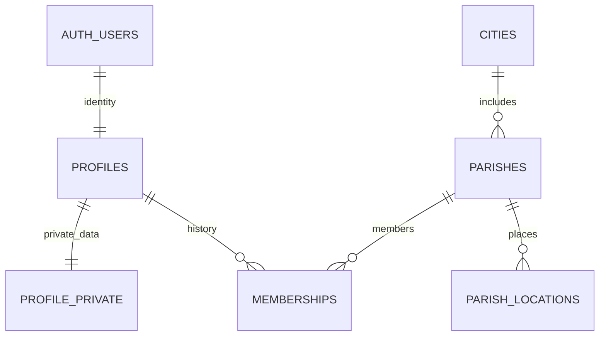
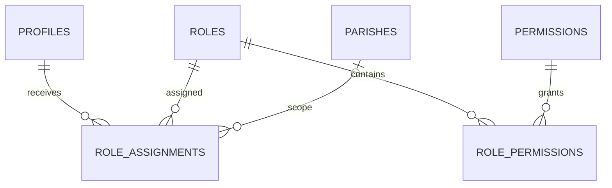
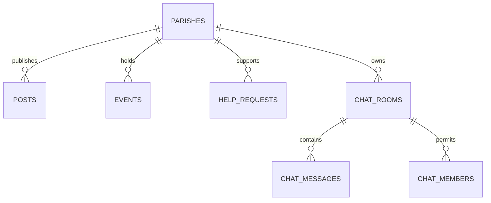

# База данных

22 таблицы: 14 в `public`, 8 в `app_private`. `public` — пространство API, а не утверждение о публичности каждой строки. Все таблицы включают RLS. `app_private` не входит в exposed schemas; клиентам не выдаётся SELECT на его таблицы.

| Таблица | Ключи и связи | Приватность/назначение |
|---|---|---|
| cities | id; country_code; timezone | Публичный справочник городов |
| parishes | id; city_id → cities; unique slug | Публикация, координаты, open/approval вступление |
| parish_locations | id; parish_id → parishes; unique(id,parish_id) | Несколько мест одного прихода |
| profiles | id → auth.users | Только отображаемое имя и настройка видимости |
| profile_private | user_id → profiles | Имя, фамилия, дата рождения; только собственный RPC |
| memberships | id; user_id → profiles; parish_id → parishes | История членства и заявок |
| permissions | key | Справочник атомарных действий и scope |
| roles | id; unique key; title; scope; baseline | Расширяемые наборы прав |
| role_permissions | PK(role_id,permission_key) | M:N ролей и разрешений |
| role_assignments | id; user_id; role_id; parish_id? | Назначение, срок действия, выдавший |
| posts | id; parish_id; author_id | Общая/приходская лента, черновики, публикация |
| events | id; parish_id; location_id; created_by | Начало/конец timestamptz, IANA timezone |
| event_attendees | PK(event_id,user_id) | Приватная регистрация участия |
| help_requests | id; parish_id; author_id | Модерируемая публикация просьб |
| help_responses | id; request_id; user_id | Отклик видит автор отклика и модератор |
| chat_rooms | id; parish_id; created_by | group/channel, parish/restricted |
| chat_members | PK(room_id,user_id) | Допуск в закрытые комнаты |
| chat_messages | id; room_id; author_id; unique(author_id,client_nonce) | Текст, дата, мягкое удаление |
| notifications | id; user_id | Собственные входящие, безопасный внутренний путь |
| push_subscriptions | id; user_id; unique(user_id,device_key) | Приватные подписки/токены; только будущий backend |
| notification_outbox | id; unique notification_id | Очередь доставки и повторов |
| audit_log | bigint id; actor_id; entity_id; parish_id | Серверный журнал действий без текстов сообщений |

Таблицы `profile_private`, `permissions`, `roles`, `role_permissions`, `role_assignments`, `push_subscriptions`, `notification_outbox`, `audit_log` находятся в `app_private`.

Email/телефон/хэш пароля обслуживает Supabase Auth; эти данные не дублируются в публичном профиле. Членство в религиозной общине не публикуется в общедоступном каталоге. `profiles` доступен самому пользователю и, если он разрешил, участникам того же прихода. Администратор прихода не получает дату рождения или контакты через права модерации.

## Инварианты

- На пользователя не более одного текущего членства: частичный unique index для `pending/active`. Дополнительный приход требует выхода/отмены заявки; история сохраняется.
- Блокировка хранится отдельным историческим состоянием `banned`; выход не снимает её. Разблокировка — решение администратора, перевод в `rejected`, затем новая заявка.
- Операции членства сериализованы по строке профиля. Окончание active-членства удаляет роли и закрытые chat memberships этого прихода.
- Scope роли соответствует назначению: global → parish_id NULL; parish → действующее членство в указанном приходе. Baseline-роли не назначаются строками.
- Событие не может ссылаться на площадку другого прихода: составной foreign key.
- Пользовательский клиент не может изменять parish_id/author_id/id существующей публикации — не выдаются UPDATE-права на эти колонки.
- Будущие публикации и черновики не выдаются обычному чтению. Архивирование вместо клиентского физического удаления.
- Личные сообщения не предусмотрены: у каждого чата есть parish_id и тип group/channel. Restricted означает явный допуск действующим участникам.
- send_message проверяет комнату, разрешение, активность, размер тела и nonce; повтор с тем же nonce не создаёт дубль. Есть базовое ограничение частоты.
- Приватные профили, роли и outbox исключены из Realtime publication. У chat_messages нет клиентского DELETE; это избегает утечки через особенности DELETE-событий Realtime.
- Серверные даты хранятся как timestamptz. Дата рождения — date. Местное время события должно отображаться по timezone события; полный виджет этого отображения ещё нужно завершить.

## Миграции

1. `202609100001_schema.sql` — таблицы, связи, индексы, RLS по умолчанию.
2. `202609100002_permissions.sql` — каталог прав, стартовые роли, функции проверок, триггеры.
3. `202609100003_rls.sql` — гранты столбцов и политики строк.
4. `202609100004_rpc.sql` — проверяемые операции членства, ролей, чатов и профиля.
5. `202609100005_realtime_audit.sql` — publication, аудит материалов, очередь уведомлений.
6. `202609100006_role_catalog.sql` — создание/редактирование наборов прав и чтение аудита.

Значения роли/разрешений расширяются данными; семантика совершенно нового разрешения должна быть реализована в серверных политиках/операциях. Добавление права в справочник само по себе не создаёт новую функцию приложения.

## Миграция 7: административные формы

`parishes.created_by` хранит автора создания для проверки повторного запроса; у прежних записей остаётся NULL. Добавлены индексы просмотра заявок pending и публикаций администратора. RPC: `admin_parishes`, `admin_pending_memberships`, `admin_save_parish`, `admin_save_post`. Запись атомарна; ограничения полей и прав проверяются сервером. Старые миграции не изменены. Детали контрактов — в `ADMIN_UPDATE.md` и самой миграции.

## Миграция 8: личный профиль

В существующие `profiles` и `profile_private` добавлены счётчики `revision`. Старые данные и выбранная видимость не меняются. Новые аккаунты получают `directory_visibility=private`. Новых таблиц нет.

`my_profile()` возвращает собственную отображаемую и личную часть профиля. `save_my_profile` сохраняет обе строки в одной транзакции с проверкой права `profile.self`, идентичности сессии, длины полей, даты и обеих версий. `p_expected_user_id` — только защита от смены аккаунта, а не выбор пользователя для редактирования. Строки выбираются по `auth.uid()`.

Отображаемое имя обязательно; имя, фамилия и дата рождения необязательны и могут быть очищены. Дата передаётся как календарное `YYYY-MM-DD`, допустимый диапазон — 1900-01-01 .. текущая дата UTC. Нельзя сохранить частично заполненную половину профиля при отказе второй записи. Повтор с теми же значениями после потерянного ответа возвращает текущий профиль без новой записи; другой устаревший ввод вызывает `profile_edit_conflict`.

Триггеры учитывают записи старых клиентов: прямое разрешённое обновление display_name/видимости и прежний `update_private_profile` повышают версии. Предыдущие RPC и гранты остаются совместимыми. Личные поля не добавлены в публичную таблицу, аудит или Realtime. Владельцы БД по-прежнему имеют административный доступ; это не сквозное шифрование.

## Миграция 9: управление чатами

`chat_rooms` дополнена полями `description` (до 300 символов), `icon_key` (ключ каталога иконок), `sort_order` (0..10000), `revision` (целое >0, триггер увеличивает при обновлении). Индекс `(parish_id, sort_order, title, id)` поддерживает меню. Прежние восемь миграций не изменяются.

`admin_chat_rooms` возвращает доступные управлению комнаты выбранного прихода, включая архив и закрытые комнаты; курсор по UUID. `admin_save_chat` возвращает JSONB-объект комнаты; проверяет chats.manage, тип, длины, диапазоны, ожидаемый аккаунт и ревизию; сериализует записи одного UUID транзакционной advisory-блокировкой. Идентичный повтор возвращает текущую строку без повторного аудита. Создание использует access=parish, правки сохраняют access/parish/created_by. Прямые клиентские записи комнат отозваны. Архив не удаляет сообщения.
